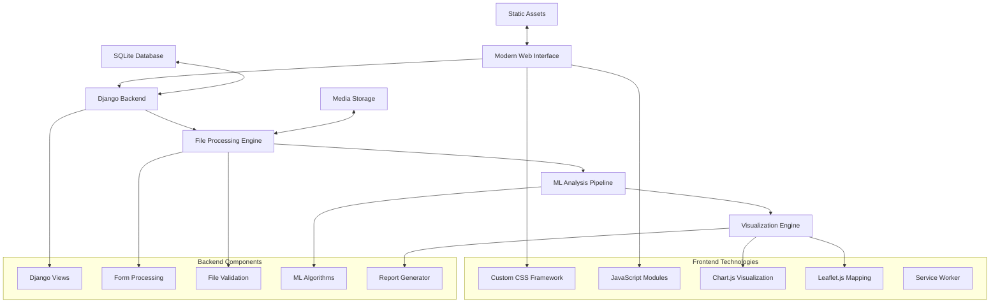
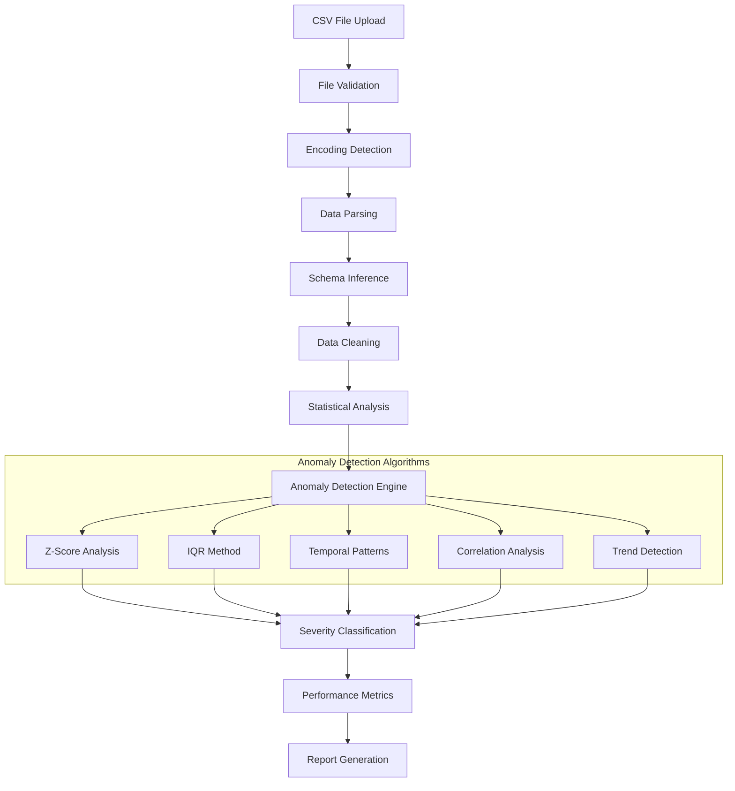

# 🚀 NIKA - Next-Gen Intelligent Knowledge Anomaly Mapping

<div align="center">
  
  
  
  
  
  
</div>

<div align="center">
  <h3>🔍 Intelligent Anomaly Detection • 📊 Interactive Visuali### **Data Access API**

**Request Parameters:**
- `format`: json, csv, excel
- `limit`: Maximum number of records
- `filter`: Column-based filtering
- `sort`: Sorting specification

**Example:**
```bash
curl "http://localhost:8000/api/data/?format=json&limit=100&sort=date_desc"
```

## 🧪 Testing

Run the test suite to ensure everything is working correctly:

```bash
# Run all tests
python manage.py test

# Run tests for specific app
python manage.py test explorer

# Run tests with verbose output
python manage.py test --verbosity=2
```

### 🔧 Development Testing

```bash
# Install development dependencies (if available)
pip install -r requirements-dev.txt

# Run development server with debug mode
python manage.py runserver --settings=nika.settings_dev
```

## � Deploymenteographic Mapping</h3>
  <p><em>A modern Django platform for geochemical data analysis and cave/mine image processing with advanced anomaly detection</em></p>
</div>

## 📋 Table of Contents

- [Overview](#-overview)
- [🆕 Latest Updates - Modern UI Integration](#-latest-updates---modern-ui-integration)
- [✨ Features](#-features)
- [🏗️ System Architecture](#️-system-architecture)
- [🛠️ Tech Stack](#️-tech-stack)
- [🚀 Installation](#-installation)
- [📁 Project Structure](#-project-structure)
- [🎯 Usage](#-usage)
- [🎨 UI Components](#-ui-components)
- [� Data Processing Pipeline](#-data-processing-pipeline)
- [�🔧 Configuration](#-configuration)
- [📱 Mobile Experience](#-mobile-experience)
- [🧪 Testing](#-testing)
- [🚀 Deployment](#-deployment)
- [📡 API Documentation](#-api-documentation)
- [🤝 Contributing](#-contributing)
- [📄 License](#-license)

## 🔍 Overview

**NIKA** is a sophisticated web application designed for geological anomaly detection and analysis. It combines advanced machine learning capabilities with a modern, intuitive interface to process geochemical CSV data and cave/mine images, identifying anomalies and providing comprehensive visualization tools.

### 🎯 Core Capabilities

- **🧠 Intelligent Anomaly Detection**: Advanced ML algorithms for pattern recognition in geological data
- **📊 Interactive Data Visualization**: Real-time charts, maps, and statistical displays  
- **🗺️ Geographic Mapping**: Interactive maps with anomaly visualization using Leaflet.js
- **📸 Image Analysis**: Cave and mine image processing with overlay detection
- **📋 Automated Reporting**: Professional PDF reports with comprehensive analysis
- **🎨 Modern UI**: Dark theme with responsive design and mobile optimization

## 🆕 Latest Updates - Modern UI Integration

### ✨ **Version 2.0 - Complete UI Overhaul**

#### 🎨 **Modern Interface Design**
- **Dark Theme UI**: Professional dark interface with light mode toggle
- **Responsive Design**: Fully optimized for desktop, tablet, and mobile devices
- **Interactive Dashboard**: Single-page application experience with tabbed navigation
- **Modern Components**: Cards, buttons, forms with smooth animations and transitions
- **Professional Gradients**: Beautiful color schemes and visual hierarchy

#### 📊 **Enhanced Data Visualization**
- **Chart.js Integration**: Interactive doughnut charts, line charts, and statistical displays
- **Leaflet.js Maps**: Geographic visualization of anomaly locations with interactive markers
- **Image Overlays**: Side-by-side comparison of original and processed images
- **Real-time Metrics**: Live updating statistics and performance indicators
- **Full-screen Views**: Expandable charts, maps, and images for detailed analysis

#### 🗂️ **Advanced File Upload System**
- **Drag-and-Drop Interface**: Modern file upload with visual feedback
- **Progress Tracking**: Real-time upload progress with file validation
- **File Management**: Support for CSV and image files with size and type validation
- **Error Handling**: Comprehensive error messages and user guidance
- **Mobile Optimization**: Touch-friendly upload interface for mobile devices

#### 🎯 **Integrated Results System**
- **Tabbed Interface**: Seamless navigation between upload, CSV results, image results, and comparison
- **Modern Result Pages**: Beautiful presentation of analysis results with detailed metrics
- **Interactive Elements**: Clickable anomaly markers, expandable result cards, and filtering options
- **Export Capabilities**: Enhanced report generation and data export features

## ✨ Features

### 🧠 **Advanced Anomaly Detection**

#### 📊 CSV Data Analysis
- **Statistical Outliers**: Z-score and IQR-based detection methods
- **Temporal Patterns**: Time-series anomaly identification
- **Correlation Analysis**: Relationship break detection between variables
- **Trend Analysis**: Long-term pattern deviation identification
- **Seasonal Detection**: Periodic anomaly recognition
- **Geographic Correlation**: Location-based anomaly clustering
- **Multi-variable Analysis**: Complex pattern recognition across datasets

#### 📸 Image Processing
- **Deep Learning Models**: Advanced computer vision for structural analysis
- **Overlay Detection**: Visual anomaly highlighting with confidence scores
- **Feature Extraction**: Geological feature identification and classification
- **Structural Analysis**: Cave and mine structural integrity assessment
- **Color Analysis**: Chemical composition inference from visual data
- **Edge Detection**: Fracture and discontinuity identification

### 🎨 **Modern User Interface**

#### 🖥️ **Dashboard Experience**
- **Integrated Workspace**: All tools accessible from single dashboard
- **Interactive Navigation**: Smooth tabbed interface with keyboard shortcuts
- **Real-time Updates**: Live progress tracking and status updates
- **Responsive Layout**: Adaptive design for all screen sizes
- **Theme Customization**: Dark/light mode toggle with user preferences

#### 📊 **Data Visualization**
- **Interactive Charts**: Hover effects, zooming, and data point details
- **Geographic Maps**: Clustered markers, layer controls, and full-screen viewing
- **Image Comparison**: Split-screen view with overlay toggle functionality
- **Statistical Displays**: Real-time metrics with animated counters
- **Export Options**: High-quality image and data export capabilities

#### 📱 **Mobile Experience**
- **Touch Interface**: Optimized for finger navigation and gestures
- **Collapsible Navigation**: Space-efficient mobile menu system
- **Responsive Charts**: Mobile-optimized visualizations and interactions
- **File Upload**: Touch-friendly drag-and-drop with camera integration
- **Offline Support**: Service worker for basic offline functionality

## 🏗️ System Architecture



### 🔧 Technology Stack

| Layer | Technology | Purpose |
|-------|------------|---------|
| **Frontend** | Custom CSS + JavaScript | Modern responsive UI framework |
| **Visualization** | Chart.js + Leaflet.js | Interactive charts and mapping |
| **Backend** | Django 5.2.6 | Web framework and API |
| **Processing** | Python + Custom ML | Data analysis and anomaly detection |
| **Database** | SQLite | Data storage and session management |
| **Deployment** | Static Files + Media | Asset serving and file management |

## 🛠️ Tech Stack

### 🎨 **Frontend Technologies**
- **CSS Framework**: Custom utility-first CSS with CSS variables for theming
- **JavaScript**: Modern ES6+ modules with class-based architecture
- **Icons**: Lucide Icons for consistent, modern iconography
- **Charts**: Chart.js for interactive data visualization
- **Maps**: Leaflet.js for geographic data visualization
- **Service Worker**: Offline support and caching capabilities

### 🔧 **Backend Technologies**
- **Framework**: Django 5.2.6 with modern Python features
- **Database**: SQLite for development, PostgreSQL-ready for production
- **File Processing**: Custom file handling with validation and security
- **ML Processing**: Scikit-learn style algorithms with custom implementations
- **Report Generation**: ReportLab for professional PDF creation

### 📦 **Key Dependencies**
```python
# Core Framework
Django==5.2.6
Pillow==11.3.0          # Image processing
reportlab==4.4.4        # PDF generation

# Frontend Assets
# Served via CDN for optimal performance
Chart.js                # Data visualization
Leaflet.js             # Interactive mapping
Lucide Icons           # Modern icon library
Inter Font             # Professional typography
```

## 🚀 Installation

### 📋 Prerequisites
- Python 3.10 or higher
- pip package manager
- Git for version control
- Modern web browser (Chrome 90+, Firefox 90+, Safari 14+)

### 🛠️ Setup Instructions

1. **Clone the Repository**
   ```bash
   git clone https://github.com/Naman-56-56/nika.git
   cd nika
   ```

2. **Create Virtual Environment**
   ```bash
   # Windows
   python -m venv env
   env\Scripts\activate

   # macOS/Linux
   python3 -m venv env
   source env/bin/activate
   ```

3. **Install Dependencies**
   ```bash
   pip install -r requirements.txt
   ```

4. **Setup Django**
   ```bash
   python manage.py migrate
   python manage.py collectstatic --noinput
   ```

5. **Run Development Server**
   ```bash
   python manage.py runserver
   ```

6. **Access Application**
   - Open browser to `http://localhost:8000`
   - Enjoy the modern NIKA dashboard!

### 🔧 **Development Setup**
```bash
# Enable debug mode
export DEBUG=True

# Set custom port
python manage.py runserver 8080

# Clear cache and restart
python manage.py collectstatic --clear --noinput
```

## 📁 Project Structure

```
nika/
├── 🎨 static/                    # Frontend assets
│   ├── css/
│   │   └── nika.css             # Modern CSS framework
│   ├── js/
│   │   ├── nika.js              # Main application JavaScript
│   │   └── sw.js                # Service worker
│   └── images/                   # Static images and icons
│
├── 📄 templates/                 # Django templates
│   ├── base.html                # Modern base template
│   ├── dashboard.html           # Integrated dashboard
│   ├── csv_results.html         # CSV analysis results
│   └── image_results.html       # Image analysis results
│
├── 🧠 explorer/                  # Main Django application
│   ├── views.py                 # Request handling and business logic
│   ├── urls.py                  # URL routing configuration
│   ├── utils.py                 # ML processing utilities
│   ├── forms.py                 # File upload forms
│   ├── models.py                # Data models (if needed)
│   └── admin.py                 # Django admin configuration
│
├── ⚙️ nika/                      # Django project settings
│   ├── settings.py              # Application configuration
│   ├── urls.py                  # Main URL configuration
│   └── wsgi.py                  # WSGI application
│
├── 📁 media/                     # User uploaded files
│   └── uploads/                 # Processed files storage
│
├── 📦 staticfiles/               # Collected static files (production)
├── 🗃️ db.sqlite3               # SQLite database
├── 📋 requirements.txt          # Python dependencies
├── 🏃 manage.py                 # Django management script
└── 📖 README.md                 # This file
```

### 📊 **File Size Overview**
```
Total Lines of Code: ~3,500
CSS Framework: ~800 lines
JavaScript Application: ~600 lines
Django Backend: ~1,200 lines
Templates: ~900 lines
```

## 🎯 Usage

### 📊 **CSV Data Analysis**

1. **Upload Geochemical Data**
   - Navigate to the dashboard
   - Click or drag CSV files to the upload area
   - Files are validated for format and size
   - Real-time progress tracking during upload

2. **View Analysis Results**
   - Switch to "CSV Results" tab
   - Interactive metrics dashboard with key statistics
   - Geographic map with anomaly markers
   - Detailed anomaly list with severity levels
   - Statistical charts and distributions

3. **Export and Share**
   - Generate comprehensive PDF reports
   - Export data in various formats
   - Share results via direct links

### 📸 **Image Analysis**

1. **Upload Cave/Mine Images**
   - Select "Upload" tab on dashboard
   - Drag and drop image files (JPG, PNG, TIFF)
   - Automatic file validation and processing
   - Progress tracking with visual feedback

2. **Analyze Results**
   - View original vs processed images side-by-side
   - Interactive anomaly overlays with confidence scores
   - Full-screen image viewing capabilities
   - Detailed anomaly information cards

3. **Compare and Export**
   - Use "Comparison" tab to correlate CSV and image data
   - Export analysis results and images
   - Generate integrated reports

### 🎮 **Interactive Features**

#### 🗺️ **Geographic Mapping**
- **Interactive Markers**: Click markers to view anomaly details
- **Layer Controls**: Toggle different data layers on/off
- **Zoom and Pan**: Navigate geographic regions smoothly
- **Full-screen Mode**: Maximize maps for detailed analysis

#### 📊 **Data Visualization**
- **Hover Effects**: Get detailed information on chart hover
- **Zoom Controls**: Focus on specific data ranges
- **Animation**: Smooth transitions and loading states
- **Responsive Design**: Optimal viewing on all devices

## 📊 Data Processing Pipeline

### 🔄 CSV Processing Architecture



### 📈 Statistical Processing Pipeline

| Stage | Input | Processing | Output | Time Complexity |
|-------|-------|------------|--------|----------------|
| **Validation** | Raw file | Format/size check | Validated data | O(1) |
| **Parsing** | CSV data | Pandas-like parsing | DataFrame | O(n) |
| **Cleaning** | Raw data | Handle nulls, types | Clean dataset | O(n) |
| **Statistics** | Clean data | Mean, std, quartiles | Descriptive stats | O(n) |
| **Anomaly Detection** | Statistics | Multiple algorithms | Anomaly list | O(n log n) |
| **Reporting** | All results | PDF generation | Final report | O(k) where k=anomalies |

### 🖼️ Image Processing Workflow

```python
def image_processing_pipeline(image_file):
    """
    Comprehensive image analysis pipeline
    """
    stages = [
        'format_validation',      # Check file type and integrity
        'metadata_extraction',    # EXIF, dimensions, color profile
        'content_analysis',       # Histogram, color distribution
        'quality_assessment',     # Blur, noise, compression analysis
        'feature_extraction',     # Basic computer vision features
        'report_compilation'      # Generate analysis summary
    ]
    
    results = {}
    for stage in stages:
        results[stage] = process_stage(image_file, stage)
    
    return compile_image_report(results)
```

### ⚡ How It Works

#### 🔍 CSV Data Analysis Process
```
📁 File Upload → 🔍 Validation → 📊 Statistical Analysis → 🚨 Anomaly Detection → 📈 Metrics Calculation → 📋 Report Generation
```

1. **File Ingestion**: Secure upload with validation (file type, size, format)
2. **Data Parsing**: Intelligent CSV parsing with encoding detection
3. **Statistical Analysis**: Calculate mean, median, standard deviation, quartiles
4. **Anomaly Detection**: Apply multiple algorithms:
   - Statistical outliers (Z-score, IQR method)
   - Temporal pattern deviations
   - Correlation breaks
   - Trend anomalies
   - Seasonal deviations
5. **Performance Metrics**: Generate F1-score, precision, recall, accuracy
6. **Report Compilation**: Create comprehensive PDF with visualizations

#### 🖼️ Image Processing Workflow
```
🖼️ Image Upload → 🔍 Format Detection → 📏 Dimension Analysis → 🎨 Content Analysis → 📊 Feature Extraction → 📋 Summary Report
```

1. **Image Validation**: Support for JPG, PNG, WebP, SVG, GIF, BMP
2. **Metadata Extraction**: EXIF data, dimensions, color profiles
3. **Content Analysis**: Basic image properties and characteristics
4. **Feature Detection**: Edge detection, color histogram analysis
5. **Quality Assessment**: Blur detection, noise analysis
6. **Report Generation**: Visual analysis summary with recommendations

## 🎨 UI Components

### 🎯 **Dashboard Layout**

#### **Navigation System**
- **Sidebar Navigation**: Collapsible sidebar with icon navigation
- **Tabbed Interface**: Smooth tab switching between different views
- **Mobile Menu**: Responsive navigation for mobile devices
- **Breadcrumbs**: Clear navigation path indication

#### **Upload Interface**
- **Drag-and-Drop Zones**: Visual feedback for file dropping
- **Progress Indicators**: Real-time upload progress with animations
- **File Validation**: Instant feedback for file type and size validation
- **Multiple File Support**: Handle multiple files with batch processing

#### **Results Display**
- **Metrics Cards**: Gradient cards with animated counters
- **Interactive Charts**: Hover effects and data point details
- **Data Tables**: Sortable and filterable result tables
- **Image Galleries**: Thumbnail views with full-screen capability

### 🎨 **Visual Design System**

#### **Color Palette**
```css
/* Primary Colors */
--primary: #6366f1      /* Primary actions and highlights */
--accent: #8b5cf6       /* Secondary actions and emphasis */
--success: #10b981      /* Success states and positive metrics */
--warning: #f59e0b      /* Warning states and attention */
--destructive: #ef4444  /* Error states and critical issues */

/* Theme Colors */
--background: #0f0f23   /* Main background (dark mode) */
--foreground: #ededed   /* Text color (dark mode) */
--card: #1a1a2e         /* Card backgrounds */
--border: #27272a       /* Border colors */
--muted: #3a3a5c        /* Muted backgrounds */
```

#### **Typography Scale**
- **Font Family**: Inter (Google Fonts)
- **Heading Sizes**: h1 (2.5rem) to h6 (1.125rem)
- **Body Text**: 1rem with 1.6 line height
- **Small Text**: 0.875rem for captions and labels

#### **Spacing System**
- **Base Unit**: 0.25rem (4px)
- **Common Spacing**: 0.5rem, 1rem, 1.5rem, 2rem
- **Container Padding**: 1rem mobile, 2rem desktop
- **Card Padding**: 1.5rem standard

## 🔧 Configuration

### ⚙️ **Django Settings**

```python
# settings.py key configurations

# Static Files
STATIC_URL = 'static/'
STATICFILES_DIRS = [BASE_DIR / 'static']
STATIC_ROOT = BASE_DIR / 'staticfiles'

# Media Files
MEDIA_URL = 'media/'
MEDIA_ROOT = BASE_DIR / 'media'

# File Upload Settings
FILE_UPLOAD_MAX_MEMORY_SIZE = 50 * 1024 * 1024  # 50MB
DATA_UPLOAD_MAX_MEMORY_SIZE = 50 * 1024 * 1024   # 50MB

# Security Settings
SECURE_CROSS_ORIGIN_OPENER_POLICY = "same-origin-allow-popups"
SECURE_REFERRER_POLICY = "same-origin"
```

### 🎨 **UI Customization**

```css
/* Custom CSS variables can be overridden */
:root {
  --primary: #your-color;
  --font-sans: 'Your-Font', sans-serif;
  --border-radius: 0.5rem;
}

/* Light mode customization */
[data-theme="light"] {
  --background: #ffffff;
  --foreground: #0f172a;
  --card: #ffffff;
}
```

### 🔧 **JavaScript Configuration**

```javascript
// Global configuration options
window.NIKA_CONFIG = {
  theme: 'dark',
  chartAnimations: true,
  mapProvider: 'openstreetmap',
  uploadChunkSize: 1024 * 1024,  // 1MB chunks
  maxFileSize: 50 * 1024 * 1024   // 50MB limit
};
```

## 📱 Mobile Experience

### 📱 **Responsive Breakpoints**
```css
/* Mobile First Approach */
/* xs: 0px */     /* Default styles */
/* sm: 640px */   /* Small tablets */
/* md: 768px */   /* Tablets */
/* lg: 1024px */  /* Small laptops */
/* xl: 1280px */  /* Laptops and up */
```

### 🎮 **Mobile-Specific Features**
- **Touch Navigation**: Swipe gestures for tab navigation
- **Collapsible Sidebar**: Space-efficient mobile menu
- **Optimized Charts**: Touch-friendly chart interactions
- **Mobile Upload**: Integration with device camera for image upload
- **Responsive Tables**: Horizontal scrolling with sticky headers

### 🔧 **Performance Optimizations**
- **Lazy Loading**: Images and charts load on demand
- **Code Splitting**: JavaScript modules loaded as needed
- **Asset Compression**: Minified CSS and JavaScript
- **Service Worker Caching**: Offline asset availability
- **Responsive Images**: Optimized images for different screen sizes

## 🧪 Testing

### ✅ **Manual Testing Checklist**

#### **File Upload Testing**
- [ ] CSV file upload with various file sizes
- [ ] Image file upload (JPG, PNG, TIFF formats)
- [ ] File validation for unsupported formats
- [ ] Large file handling (up to 50MB)
- [ ] Multiple file upload scenarios
- [ ] Network interruption handling

#### **UI/UX Testing**
- [ ] Theme toggle functionality (dark/light mode)
- [ ] Responsive design on different screen sizes
- [ ] Navigation between tabs and pages
- [ ] Interactive chart and map functionality
- [ ] Mobile touch interface testing
- [ ] Browser compatibility testing

#### **Data Processing Testing**
- [ ] CSV anomaly detection accuracy
- [ ] Image processing and overlay generation
- [ ] Report generation and export functionality
- [ ] Error handling for malformed data
- [ ] Performance with large datasets

### 🔧 **Browser Compatibility**

| Browser | Version | Status |
|---------|---------|--------|
| Chrome | 90+ | ✅ Fully Supported |
| Firefox | 90+ | ✅ Fully Supported |
| Safari | 14+ | ✅ Fully Supported |
| Edge | 90+ | ✅ Fully Supported |
| Mobile Safari | iOS 14+ | ✅ Optimized |
| Chrome Mobile | Android 10+ | ✅ Optimized |

### 📊 **Performance Metrics**
- **Page Load Time**: < 2 seconds on 3G
- **Time to Interactive**: < 3 seconds
- **First Contentful Paint**: < 1.5 seconds
- **File Upload Progress**: Real-time feedback
- **Chart Rendering**: < 500ms for standard datasets

## � API Documentation

### **Core Endpoints**

| Endpoint | Method | Description | Response Format |
|----------|--------|-------------|-----------------|
| `/` | GET | Main dashboard interface | HTML |
| `/upload/` | POST | File upload processing | JSON |
| `/results/csv/` | GET | CSV analysis results | HTML/JSON |
| `/results/images/` | GET | Image analysis results | HTML/JSON |
| `/api/data/` | GET | Raw data access | JSON |
| `/media/<file>` | GET | File downloads | Binary |

### **Upload API Example**

**Request:**
```bash
curl -X POST "http://localhost:8000/upload/" \
  -F "file=@data.csv" \
  -F "analysis_type=statistical"
```

**Response:**
```json
{
  "status": "success",
  "file_id": "abc123",
  "analysis_results": {
    "rows": 1000,
    "columns": 15,
    "data_types": {
      "numeric": 8,
      "categorical": 7
    },
    "insights": [
      "Strong correlation between variables X and Y",
      "Missing values detected in column Z"
    ]
  },
  "visualizations": [
    "/media/charts/histogram_abc123.png",
    "/media/charts/correlation_abc123.png"
  ]
}
```

### **Data Access API**

**Request Parameters:**
- `format`: json, csv, excel
- `limit`: Maximum number of records
- `filter`: Column-based filtering
- `sort`: Sorting specification

**Example:**
```bash
curl "http://localhost:8000/api/data/?format=json&limit=100&sort=date_desc"
```

## �🚀 Deployment

### 🏗️ **Production Setup**

1. **Environment Configuration**
   ```bash
   export DEBUG=False
   export SECRET_KEY="your-production-secret-key"
   export ALLOWED_HOSTS="yourdomain.com,www.yourdomain.com"
   ```

2. **Static File Collection**
   ```bash
   python manage.py collectstatic --noinput
   ```

3. **Database Migration**
   ```bash
   python manage.py migrate
   ```

4. **Security Headers** (nginx configuration)
   ```nginx
   add_header X-Frame-Options DENY;
   add_header X-Content-Type-Options nosniff;
   add_header X-XSS-Protection "1; mode=block";
   add_header Strict-Transport-Security "max-age=31536000";
   ```

### 🔧 **Performance Optimization**
- **Static File CDN**: Serve CSS/JS from CDN
- **Image Optimization**: Compress uploaded images
- **Database Indexing**: Optimize query performance
- **Caching Strategy**: Redis for session and file caching
- **Load Balancing**: Multiple application instances

### 📊 **Monitoring and Analytics**
- **Error Tracking**: Sentry integration for error monitoring
- **Performance Monitoring**: Application performance metrics
- **User Analytics**: Usage patterns and feature adoption
- **File Processing Metrics**: Upload and processing statistics

## 🐛 Troubleshooting

### ❓ **Common Issues**

#### **File Upload Problems**
```bash
# Issue: File upload fails
# Solution: Check file size and format
python manage.py shell
>>> from django.conf import settings
>>> print(settings.FILE_UPLOAD_MAX_MEMORY_SIZE)
```

#### **Static Files Not Loading**
```bash
# Issue: CSS/JS not loading
# Solution: Collect static files
python manage.py collectstatic --clear --noinput
```

#### **Theme Not Switching**
```javascript
// Issue: Theme toggle not working
// Solution: Clear localStorage and refresh
localStorage.removeItem('theme');
location.reload();
```

#### **Charts Not Rendering**
```html
<!-- Issue: Charts not displaying -->
<!-- Solution: Check Chart.js loading -->
<script>
console.log(typeof Chart !== 'undefined' ? 'Chart.js loaded' : 'Chart.js not loaded');
</script>
```

#### **Virtual Environment Issues**
```powershell
# Issue: PowerShell execution policy on Windows
Set-ExecutionPolicy -ExecutionPolicy RemoteSigned -Scope CurrentUser

# Alternative activation methods:
env\Scripts\activate.bat          # Command Prompt
env\Scripts\Activate.ps1          # PowerShell
source env/bin/activate           # Unix/Mac
```

#### **Database Migration Errors**
```bash
# Reset migrations completely
python manage.py migrate --fake explorer zero
python manage.py migrate explorer

# Or reset entire database
del db.sqlite3
python manage.py migrate
python manage.py createsuperuser
```

#### **Performance & Memory Issues**
```bash
# Check system resources
python -c "import psutil; print(f'CPU: {psutil.cpu_percent()}%, RAM: {psutil.virtual_memory().percent}%')"

# For large files, configure chunked processing
# In settings.py:
FILE_UPLOAD_MAX_MEMORY_SIZE = 100 * 1024 * 1024  # 100MB
PROCESSING_TIMEOUT = 600  # 10 minutes
```

### 🔧 **Debug Mode**
```python
# Enable detailed error reporting
DEBUG = True
LOGGING = {
    'version': 1,
    'disable_existing_loggers': False,
    'handlers': {
        'console': {
            'class': 'logging.StreamHandler',
        },
    },
    'loggers': {
        'django': {
            'handlers': ['console'],
            'level': 'DEBUG',
        },
    },
}
```

## 🤝 Contributing

### 🛠️ **Development Guidelines**

1. **Code Standards**
   - Follow PEP 8 for Python code
   - Use meaningful variable and function names
   - Add docstrings for all functions and classes
   - Maintain consistent indentation (4 spaces)

2. **Frontend Standards**
   - Use semantic HTML5 elements
   - Follow BEM methodology for CSS classes
   - Write modular JavaScript with clear separation of concerns
   - Ensure accessibility compliance (WCAG 2.1)

3. **Testing Requirements**
   - Write unit tests for new functionality
   - Test across multiple browsers and devices
   - Validate responsive design implementation
   - Check accessibility with screen readers

4. **Documentation**
   - Update README for new features
   - Add inline comments for complex logic
   - Create user guides for new functionality
   - Update API documentation if applicable

### 🚀 **Feature Request Process**

1. **Issue Creation**
   - Use GitHub Issues template
   - Provide detailed feature description
   - Include mockups or wireframes if UI-related
   - Explain business value and user benefit

2. **Development Workflow**
   ```bash
   # Create feature branch
   git checkout -b feature/your-feature-name
   
   # Make changes and commit
   git add .
   git commit -m "Add: new feature description"
   
   # Push and create pull request
   git push origin feature/your-feature-name
   ```

3. **Pull Request Guidelines**
   - Write clear, descriptive commit messages
   - Include screenshots for UI changes
   - Update tests and documentation
   - Request code review from team members

### 🎯 **Priority Features Roadmap**

#### **Q4 2025**
- [ ] **Real-time Collaboration**: Multi-user analysis sessions
- [ ] **API Development**: RESTful API for external integrations
- [ ] **Advanced ML Models**: Custom neural network implementations
- [ ] **Database Optimization**: PostgreSQL migration and indexing

#### **Q1 2026**
- [ ] **User Authentication**: Multi-user support with role-based access
- [ ] **Project Management**: Organize analyses into projects
- [ ] **Batch Processing**: Process multiple files simultaneously
- [ ] **Advanced Exports**: Excel, JSON, and XML export formats

#### **Q2 2026**
- [ ] **Cloud Integration**: AWS/Azure storage and processing
- [ ] **Advanced Visualization**: 3D plotting and VR support
- [ ] **Machine Learning Training**: Custom model training interface
- [ ] **Integration APIs**: Connect with popular GIS software

## 📄 License

### 📝 **MIT License**

```
MIT License

Copyright (c) 2025 NIKA Development Team

Permission is hereby granted, free of charge, to any person obtaining a copy
of this software and associated documentation files (the "Software"), to deal
in the Software without restriction, including without limitation the rights
to use, copy, modify, merge, publish, distribute, sublicense, and/or sell
copies of the Software, and to permit persons to whom the Software is
furnished to do so, subject to the following conditions:

The above copyright notice and this permission notice shall be included in all
copies or substantial portions of the Software.

THE SOFTWARE IS PROVIDED "AS IS", WITHOUT WARRANTY OF ANY KIND, EXPRESS OR
IMPLIED, INCLUDING BUT NOT LIMITED TO THE WARRANTIES OF MERCHANTABILITY,
FITNESS FOR A PARTICULAR PURPOSE AND NONINFRINGEMENT. IN NO EVENT SHALL THE
AUTHORS OR COPYRIGHT HOLDERS BE LIABLE FOR ANY CLAIM, DAMAGES OR OTHER
LIABILITY, WHETHER IN AN ACTION OF CONTRACT, TORT OR OTHERWISE, ARISING FROM,
OUT OF OR IN CONNECTION WITH THE SOFTWARE OR THE USE OR OTHER DEALINGS IN THE
SOFTWARE.
```

### 🤝 **Third-Party Licenses**
- **Chart.js**: MIT License
- **Leaflet.js**: BSD 2-Clause License
- **Django**: BSD License
- **Lucide Icons**: ISC License
- **Inter Font**: SIL Open Font License

---

<div align="center">
  <h3>🎯 Ready to Explore Your Data?</h3>
  <p><strong>Get started with NIKA today and discover hidden patterns in your geological data!</strong></p>
  
  <p>
    <a href="#-installation">📥 Install Now</a> •
    <a href="#-usage">📖 Quick Start Guide</a> •
    <a href="#-contributing">🤝 Contribute</a>
  </p>
  
  <p><em>Last Updated: September 29, 2025 | Version: 2.0.0 | By: NIKA Development Team</em></p>
</div>